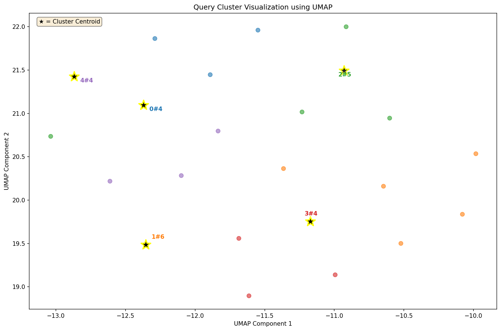

# Example Run

This example run uses cluster.py that is tuned to cluster very similar
queries, for example varying in comparison values but largely similar.

- [example-input-queries.csv](example-input-queries.csv)
- [samples.csv](samples.csv)
- [summary.csv](summary.csv)



```
(.venv) klotz@tensor:~/wip/lustre$ ./cluster.sh example/example-input-queries.csv 
Loading weights: 100%|█████████████████████████████████| 199/199 [00:00<00:00, 730.45it/s, Materializing param=pooler.dense.weight]
Using device: cuda
Applying UMAP reduction to 5D before clustering...
/home/klotz/wip/lustre/.venv/lib/python3.12/site-packages/umap/umap_.py:1952: UserWarning: n_jobs value 1 overridden to 1 by setting random_state. Use no seed for parallelism.
  warn(
UMAP(angular_rp_forest=True, metric='cosine', min_dist=0.0, n_components=5, n_jobs=1, n_neighbors=3, random_state=42, verbose=True)
Thu Feb 12 15:36:06 2026 Construct fuzzy simplicial set
Thu Feb 12 15:36:07 2026 Finding Nearest Neighbors
Thu Feb 12 15:36:09 2026 Finished Nearest Neighbor Search
Thu Feb 12 15:36:11 2026 Construct embedding
Epochs completed:   0%|                                                                                               0/500 [00:00]	completed  0  /  500 epochs
Epochs completed:   0%| ▏                                                                                             1/500 [00:00]	completed  50  /  500 epochs
	completed  100  /  500 epochs
	completed  150  /  500 epochs
	completed  200  /  500 epochs
	completed  250  /  500 epochs
	completed  300  /  500 epochs
	completed  350  /  500 epochs
	completed  400  /  500 epochs
	completed  450  /  500 epochs
Epochs completed: 100%| ███████████████████████████████████████████████████████████████████████████████████████████ 500/500 [00:00]
Thu Feb 12 15:36:11 2026 Finished embedding
UMAP reduction complete: (23, 5)
/home/klotz/wip/lustre/.venv/lib/python3.12/site-packages/umap/umap_.py:1952: UserWarning: n_jobs value 1 overridden to 1 by setting random_state. Use no seed for parallelism.
  warn(
Visualization saved to: output/umap_viz.png
(.venv) klotz@tensor:~/wip/lustre$ 
```

